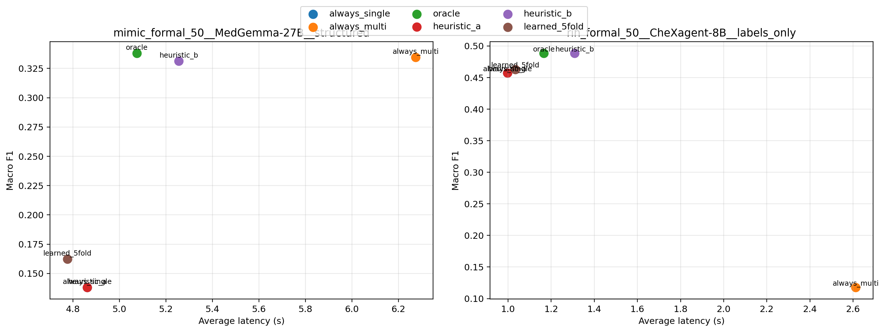

# Reliability Stress Tests and Decision-Time Routing for Chest X-ray VLMs

Code, per-case results and aggregate tables for the paper

> Xinye Yang, Zhusi Zhong, Scott Collins, Grayson Baird, Xuyu Wang, Zhicheng Jiao.
> **Reliability Stress Tests and Decision-Time Routing for Chest X-ray Vision-Language Models.**
> 2026 IEEE/ACM Conference on Connected Health: Applications, Systems and Engineering Technologies (CHASE), workshop, oral presentation.
> DOI: [10.1109/CHASE69719.2026.00073](https://doi.org/10.1109/CHASE69719.2026.00073) · [Paper page](https://yangxinyee.github.io/papers/cxr-vlm-reliability-routing/)

Three medical vision-language models (CheXagent-8B, MedGemma-4B-IT and MedGemma-27B-IT) are evaluated on two balanced 50-study chest X-ray sets. Each model runs with three prompt styles and two workflows: a single VLM pass, or a four-stage multi-agent pipeline on the same frozen weights. That makes 36 configurations. Findings:

- Exact-match accuracy overstates conservative models that default to `Normal`. MedGemma-4B reaches 52% exact match on MIMIC with a macro F1 of 0.252.
- Multi-agent reasoning helps some configurations and hurts others. It lifts MedGemma-27B (structured) on MIMIC from 0.138 to 0.335 macro F1. It drops CheXagent (labels-only) on the private cohort from 0.457 to 0.118.
- Decision-time routing, escalating to the multi-agent pipeline only for some cases, improves the cost–quality trade-off over both fixed workflows in this proof of concept.



## What is in this repository

| Path | Contents |
|---|---|
| `src/models/vlm.py` | Model wrappers (CheXagent, MedGemma, Qwen2.5-VL, LLaVA variants), local or through a vLLM OpenAI-compatible server |
| `src/metrics/` | Label parsing and the metrics: exact, partial, macro F1, hallucination FP, normal accuracy, abnormal partial |
| `scripts/run_toy_experiment.py` | Runs one model × prompt style on a dataset, single-VLM and multi-agent, and writes per-case JSON |
| `scripts/summarize_formal_results.py` | Per-configuration table (paper Tables II and III) |
| `scripts/build_analysis_tables.py` | Error taxonomy, workflow transitions and paired bootstrap (paper Table IV) |
| `scripts/build_routing_eval.py` | Routing strategies: always-single, always-multi, oracle, heuristics A and B, 5-fold logistic regression (paper Table V) |
| `scripts/verify_paper_numbers.py` | Checks the key numbers in the paper against the result files |
| `data/mimic_formal_50/toy_dataset.json` | The 50 MIMIC-CXR study IDs with our audited labels (no images, no report text) |
| `results/mimic_formal_50_experiment_*.json` | Per-case outputs for all 18 MIMIC configurations |
| `results/formal_*.csv`, `results/routing_eval/` | Aggregate tables for both cohorts |

**Not included.** No images and no report text from either cohort. The private cohort (50 studies from a US hospital system) is not released, and neither are its per-case outputs. Only its aggregate numbers are here, and they are the same as in the paper.

## Reproduce the MIMIC results

MIMIC-CXR-JPG is credentialed data. You need your own PhysioNet access.

```bash
pip install -r requirements.txt
python scripts/prepare_mimic_images.py --mimic-jpg-root /path/to/mimic-cxr-jpg/2.1.0

# MedGemma through vLLM
vllm serve google/medgemma-4b-it --port 8000
MODEL=google/medgemma-4b-it VLLM_URL=http://127.0.0.1:8000 TAG=medgemma4b_vllm \
  bash scripts/run_all.sh data/mimic_formal_50

# CheXagent locally (see scripts/download_chexagent8b.sh and patch_chexagent_compat.py)
MODEL=models/CheXagent-8b bash scripts/run_all.sh data/mimic_formal_50
```

The paper used a preprocessed copy of MIMIC-CXR with one image per study. `prepare_mimic_images.py` picks a frontal view from the official layout. For studies with more than one frontal image it may pick a different one, so rerun numbers can differ slightly.

To rebuild the tables from the per-case files in `results/`, without a GPU:

```bash
python scripts/summarize_formal_results.py
python scripts/build_analysis_tables.py
python scripts/build_routing_eval.py
python scripts/verify_paper_numbers.py
```

Rerunning these rewrites the aggregate tables with the MIMIC rows only, because the private per-case files are not here. `verify_paper_numbers.py` skips the private checks it cannot run.

## Routing strategies

| Strategy | Escalates to multi-agent when |
|---|---|
| always-single / always-multi | never / always |
| oracle | multi-agent macro F1 for the case exceeds single-VLM (hindsight) |
| heuristic A | the single pass says `Normal` and the case is marked complex (`level == 2`) |
| heuristic B | the single-pass labels share nothing with the ground-truth labels |
| learned (5-fold LR) | a logistic regression on predicted-label count, all-normal flag, response length, tokens, level and single-pass partial match |

## Citation

```bibtex
@inproceedings{yang2026cxr,
  title     = {Reliability Stress Tests and Decision-Time Routing for Chest X-ray Vision-Language Models},
  author    = {Yang, Xinye and Zhong, Zhusi and Collins, Scott and Baird, Grayson and Wang, Xuyu and Jiao, Zhicheng},
  booktitle = {2026 IEEE/ACM Conference on Connected Health: Applications, Systems and Engineering Technologies (CHASE)},
  year      = {2026},
  doi       = {10.1109/CHASE69719.2026.00073}
}
```

## Related work by the authors

- [vrm-edge-triage](https://github.com/Yangxinyee/vrm-edge-triage): confidence-gated cloud–edge triage for chest X-rays (Smart Health, 2026).
- [EHR2Trace](https://yangxinyee.github.io/projects/ehr2trace/): auditable EHR conversion to OMOP CDM and MEDS.

## License

Code: Apache-2.0 (see `LICENSE`). The MIMIC-CXR study identifiers and labels are provided for research use under the terms of your PhysioNet data use agreement. Model weights are subject to their own licenses (CheXagent, Health AI Developer Foundations terms for MedGemma).
